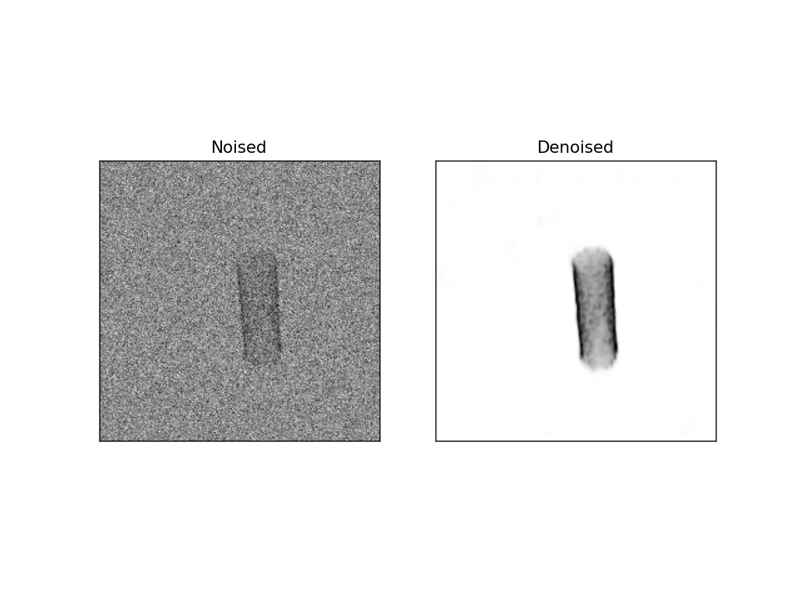

# Reprise Projet S8

The goal is to denoise high noised images of stent using U-Net model.
The implementation is avalaible in [**unet.py**](/src/model/unet.py).


# Dataset
We generate gaussian noised image with standard deviation from 0.3 to 0.5.

Exemple of stent


Noised stent


# Training
We train using configuration file. You can make your configuration file and use the command:
```bash
make train cfg=[filename]
```
But to make several trainings with different parameters, we manage to use one unique configuation file and specify the paramters as arguments. Look at implementation in [**train.py**](/src/train.py) for more context.

Use the following command for training:
```bash
make train cfg=configs/unet--noise-images-3k--bs1-lr0.01.yaml data=[data_name] bs=[batch_size] lr=[learning_rate]
```
- `data` string argument is the number of image. Look at folders in [**dataset**](/dataset/). You should use the string after -. Exemple to train on [**data-1k**](/dataset/data-1k/) dataset, use `data=1k`.
- `bs` argument for the batch_size
- `lr` argument for learning rate

We used [**training.sh**](/trainings.sh) to launch several trainings.

# Results
The batch size, the learning rate are the main hyperparameters we focused on. A learning rate of 0.01 usually leads to the best result but with dataset with much more images a learning rate of 0.1 gave best result. We use batch size of 1 or 4. Among the several training batch size of 1 seems to gave better results because there is much more randomness or variability into the training process.
We trained all the models on 10 epochs. Some of them start diverging after epoch 5/6. It concerns especially training with larger dataset of noised images and learning rate of 0.1

Please view [**logs**](/logs_/) for comparing model with available denoising image on validation set during training.
Use the command:
```bash
tensorboard --logdir logs_ --port 6006
```

Some denoised image on validation set:

- **data=90, batch_size=1, learning_rate=0.01, epoch=10** -> [**other denoised images**](/logs_/unet--noise-images-90--bs1-lr0.01_2023_12_16-03_10_40/validation/imgs)
    
    

- **data=180, batch_size=1, learning_rate=0.01, epoch=10** -> [**other denoised images**](/logs_/unet--noise-images-180--bs1-lr0.01_2023_12_16-03_13_55/validation/imgs)
    
    

- **data=270, batch_size=1, learning_rate=0.01, epoch=10** -> [**other denoised images**](/logs_/unet--noise-images-270--bs1-lr0.01_2023_12_16-03_19_04/validation/imgs)
    
    

- **data=360, batch_size=4, learning_rate=0.01, epoch=10** -> [**other denoised images**](/logs_/unet--noise-images-360--bs4-lr0.01_2023_12_16-03_30_18/validation/imgs)
    
    

- **data=540, batch_size=1, learning_rate=0.01, epoch=10** -> [**other denoised images**](/logs_/unet--noise-images-540--bs1-lr0.01_2023_12_16-03_45_54/validation/imgs)
    
    

- **data=630, batch_size=1, learning_rate=0.01, epoch=** -> [**other denoised images**](/logs_/unet--noise-images-630--bs1-lr0.01_2023_12_16-03_58_29/validation/imgs)
    
    

- **data=720, batch_size=4, learning_rate=0.01, epoch=** -> [**other denoised images**](/logs_/unet--noise-images-720--bs4-lr0.01_2023_12_16-04_21_04/validation/imgs)
    
    

- **data=810, batch_size=1, learning_rate=0.01, epoch=** -> [**other denoised images**](/logs_/unet--noise-images-810--bs1-lr0.01_2023_12_16-04_29_35/validation/imgs)
    
    

- **data=1k, batch_size=4, learning_rate=0.01, epoch=** -> [**other denoised images**](/logs_/unet--noise-images-1k--bs4-lr0.01_2023_12_16-05_32_06/validation/imgs)
    
    

- **data=2k, batch_size=4, learning_rate=0.1, epoch=** -> [**other denoised images**](/logs_/unet--noise-images-2k--bs4-lr0.1_2023_12_16-06_12_50/validation)
    
    

- **data=3k, batch_size=1, learning_rate=0.01, epoch=7** -> [**other denoised images**](/logs_/unet--noise-images-3k--bs1-lr0.01_2023_12_16-06_58_58/validation/imgs)
    
    

- **data=3k, batch_size=4, learning_rate=0.1, epoch=7** -> [**other denoised images**](/logs_/unet--noise-images-3k--bs4-lr0.1_2023_12_16-07_20_40/validation/imgs)
    
    

- **data=3k, batch_size=4, learning_rate=0.01, epoch=10** -> [**other denoised images**](/logs_/unet--noise-images-3k--bs4-lr0.01_2023_12_16-07_37_09/validation/imgs)
    
    